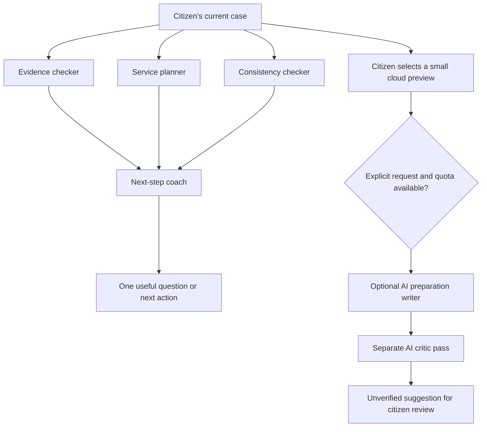

# Case team, optional AI and assisted tasks

Implementation notes and activation guide, 6 September 2026. The local case team works now; remote services need configuration and a separate live evaluation. No cloud model or remote browser is activated by this change.

## The implemented team



The first four roles are deterministic on-device checks, not language models. Evidence, service and consistency checks run concurrently. The coach depends on their actual results and asks at most one question. Sources, partial failures and cancellation remain visible. Changing any input clears the results in the same render. There is no fabricated delay, hidden document upload or case mutation.

The optional model path uses two calls to the same pinned Workers AI model: `@cf/meta/llama-3.2-3b-instruct`. The preparation writer produces a bounded question and one to three short steps. The critic can withhold the suggestion. A second call is not independent factual verification and the interface says so. Output remains plain text, source references must match the selected facts, and neither role receives tools, database write authority, government access or payment capabilities.

This bounded interaction uses the existing Worker handler. It does not need the Cloudflare Agents SDK or persistent agent instances. Longer real browser tasks will need a durable coordinator and authenticated resumptions; adding that runtime should follow the portal pilot rather than introducing an unused second state store. Cloudflare documents [adding the Agents SDK to an existing project](https://developers.cloudflare.com/agents/getting-started/add-to-existing-project/).

## Optional AI activation

1. Complete [mobility account setup](./mobility-account-setup.md), including the database migrations. Migration `0003_mobility_adviser.sql` creates the request reservation ledger. It stores request IDs, daily counts and outcomes, never prompts, case content or generated suggestions.
2. Verify the selected Cloudflare account's billing plan and usage. If a hard no-overage setup is required, use Workers Free. Cloudflare currently includes 10,000 neurons per UTC day; Workers Paid bills usage above that allocation. This application's cap does not control other applications in the same account. See [Workers AI pricing](https://developers.cloudflare.com/workers-ai/platform/pricing/).
3. Add this binding to `wrangler.jsonc` only after deciding to enable the optional provider:

   ```json
   "ai": { "binding": "MOBILITY_AI" }
   ```

4. Change the existing `MOBILITY_AI_ENABLED` variable from `"false"` to `"true"`. Both the binding and the switch are required. The default configuration contains no AI binding. See [Workers AI bindings](https://developers.cloudflare.com/workers-ai/configuration/bindings/).
5. Build and deploy through the project's normal release checks. From a signed-in account case, open **Review AI options**; the UI requests `/api/account/adviser/status` with the current account context. Direct navigation to that private endpoint does not provide the required account header. Select a fabricated short fact, inspect the exact preview and make one explicit request. The model's documented request and response shape is in [Llama 3.2 3B model documentation](https://developers.cloudflare.com/workers-ai/models/llama-3.2-3b-instruct/).
6. Evaluate English and Hindi suggestions against known test cases before offering the feature to citizens. Current tests use a provider stub and real SQLite quota conditions; they establish wiring and boundaries, not live model usefulness.

The application enforces three reservations per account and twenty across the site per UTC day. A reservation is counted before inference. Concurrent requests cannot bypass these SQL limits; duplicate request IDs do not repeat inference. Each request has at most two calls, 400 and 40 output tokens, and a 20-second deadline per call. Failed, stopped and timed-out requests remain counted because provider computation may still occur. There are no automatic retries. These are application limits, not a representation of Cloudflare's exact neuron meter.

The citizen selects up to eight short facts and optionally a draft of at most 1,200 characters; total encoded case context is at most 6,000 bytes. The server rebuilds the preview from the owner-scoped account case, checks its revision and compares its exact fingerprint. No account identity, case title, full history, source document ID or original file is sent. Detected identity-number and credential content is excluded; this detector is a conservative safeguard, not a general anonymisation guarantee. The full visible preview is still essential. User-selected text may contain personal information.

The server rechecks the case revision after both model calls. Case edits, invalid model output, unknown source references, critic rejection and provider failures withhold the result. API responses are not cached. Reservation rows expire after two days and are pruned on the next adviser request; deleting an account removes its link to the reservation while leaving anonymous site counts until expiry.

## Trusted helper access

Migration `0002_mobility_helpers.sql` adds one-case invitations. The account owner selects the facts and optional draft, sees the complete snapshot and chooses the helper's sign-in email and an expiry of one to twenty-four hours. A random invitation secret is returned once in a URL fragment; only its SHA-256 hash is stored on the server. The application does not send any invitation message.

The helper signs into their own account and deliberately accepts the invitation. Acceptance consumes it once and binds the assignment to that account. A helper can read the selected snapshot and propose wording; they cannot list the owner's cases, edit the actual case, change the profile, submit anything or pay. The owner must review the complete replacement before applying it. The final case change and application record use a guarded D1 transaction. [D1 documents batch transaction rollback](https://developers.cloudflare.com/d1/worker-api/d1-database/#batch).

Every helper read and mutation checks the assignment, expiry, revocation and the original case revision. An owner edit ends access to the older snapshot. Deleting the case or owner's account deletes its helper records. Revocation stops subsequent server access; it cannot erase copies the helper already kept. Snapshots and proposals remain with the owner's retained case until deletion or expiry cleanup, rather than being physically deleted as soon as the short access window ends.

An account can retain at most 100 invitations in total, including ended history, with at most ten active invitations. Both limits are checked in the same conditional insert. At the total limit, the owner can review and explicitly delete ended invitation history from the case's helper panel. `DELETE /api/account/helpers/:id` requires the signed-in owner's reviewed account header and the current `{revision}`; active access must be revoked first. Deletion removes that invitation's snapshot and proposal without changing the saved case or an already-applied draft. There is no silent history pruning and no claim that helper-side copies can be erased.

## Assisted-task prototype and real portal work

The local `/demo/assistance-lab` is an explicitly synthetic prototype. It exercises reviewed details, private user control, permission invalidation, interruption and receipt checks against a fictional portal. It is not evidence of live government compatibility or a real remote-browser credential boundary.

For a real pilot, select one portal, one state and one service. Establish authorized access and document its current behavior before adding an adapter. The runtime should expose narrow tools such as `readTaskStatus`, `fillReviewedFields` and `captureAcknowledgement`, with permissions enforced outside the model. Preparation authorization covers ordinary navigation and field filling; authentication and consequential choices require citizen involvement. Final approval is bound to the reviewed payload, recipient and amount.

Cloudflare's [Human in the Loop](https://developers.cloudflare.com/browser-run/features/human-in-the-loop/) provides Live View and structured handoff commands, currently beta. A real implementation must separately block screenshot, page-text, input and network-body observation during private control. Stop recordings and logs for those interactions, keep session URLs and secrets out of model context, and test that gate at the backend tool boundary. A visual handoff alone does not enforce privacy.

Cloudflare's [Browser Run FAQ](https://developers.cloudflare.com/browser-run/faq/) describes bot identification and service limitations. A successful test-portal run cannot prove that an official portal accepts remote automation. A timeout after payment or submission needs an outcome check before any retry. A real reference or acknowledgement must be matched to the intended case; an AI statement of completion is insufficient.
